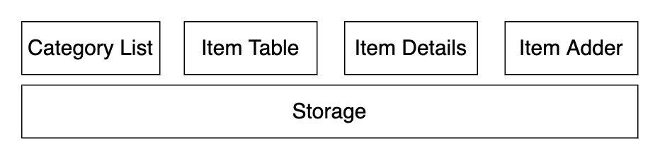

A simple standalone Javascript To Do app. 

The whole project is written using only vanilla JavaScript, HTML and CSS. No framework was used. 

## Components
Storage uses Local Storage of a browser as a NoSQL database to store the data.

